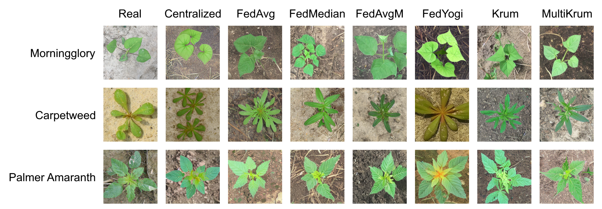
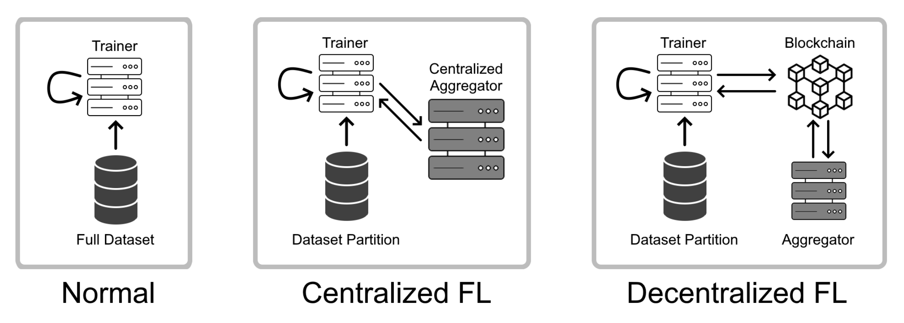

# Federated Diffusion



### Overview

This repository stores code to train Stable Diffusion models using different Federated Learning strategies, and within each strategy, using different aggregation algorithms.

The three strategies used are:
- [Centralized](centralized-model/README.md) - A baseline (non-FL) strategy.
- [Centralized FL](centralized-fl/README.md) - Train a model using FL with a central aggregator
- [Decentralized FL](decentralized-fl/README.md) - Train a model using blockchained FL and decentralized aggregation.



Six different aggregation algorithms were used in this analysis. They are:
- [FedAvg](https://arxiv.org/abs/1602.05629)
- [FedMedian](https://arxiv.org/abs/1803.01498)
- [FedAvgM](https://arxiv.org/abs/1909.06335)
- [FedYogi](https://arxiv.org/abs/2003.00295)
- [Krum](https://papers.nips.cc/paper_files/paper/2017/hash/f4b9ec30ad9f68f89b29639786cb62ef-Abstract.html)
- [MultiKrum](https://papers.nips.cc/paper_files/paper/2017/hash/f4b9ec30ad9f68f89b29639786cb62ef-Abstract.html)

This repository also includes code to evaluate the trained models via IS, FID, a downstream ResNet50 classifier, and a t-SNE projection of latent vectors.

### Results

A detailed written report of this experiment can be found in [REPORT.pdf](REPORT.pdf)

### Running

Each subdirectory contains instructions to train a model using that FL strategy in its respective README, however they all require the global Python dependencies to be installed:

```
pip install -r requirements.txt
```